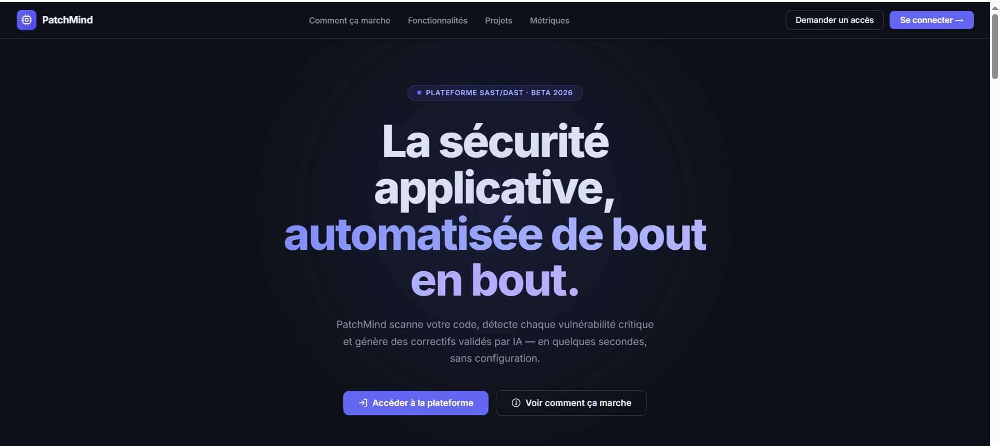
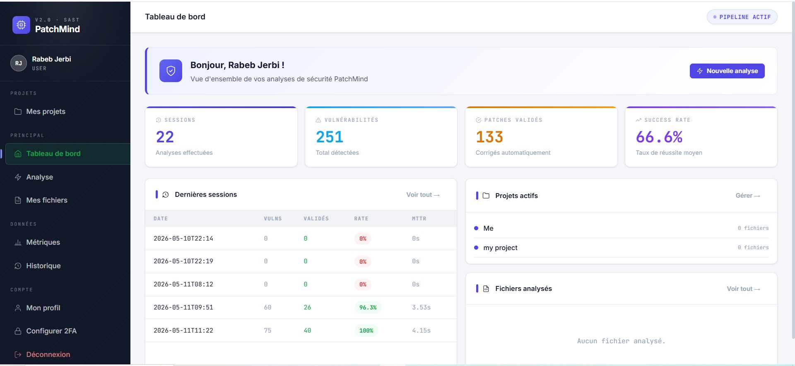
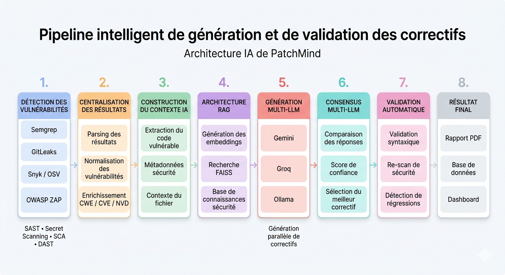
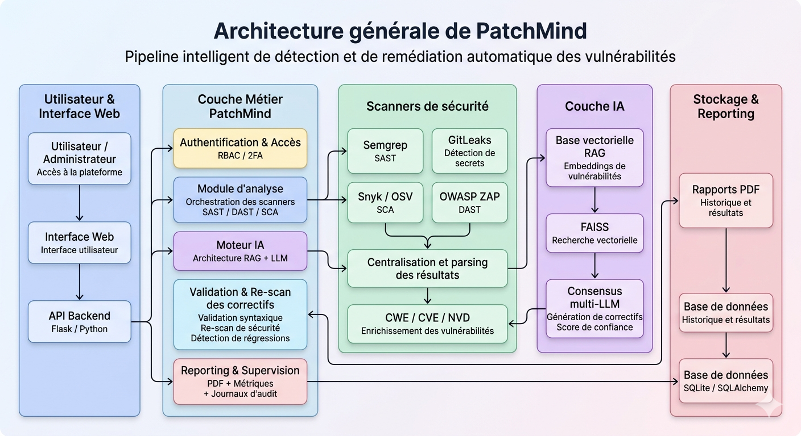

<div align="center">


# 🔒 PatchMind

**AI-Powered Application Security & Automated Remediation Platform**

*From vulnerability detection to intelligent automated remediation.*

[Overview](#-overview) · [Features](#-key-features) · [Screenshots](#-screenshots) · [Architecture](#-architecture) · [Installation](#-installation) · [Usage](#-running-patchmind)

</div>

---

## 🎯 Overview

PatchMind is an AI-powered DevSecOps platform designed to automate the entire vulnerability remediation lifecycle.

The platform allows users to upload source code files or scan GitHub repositories, automatically detect security vulnerabilities using multiple scanners, generate AI-assisted security patches, validate fixes, and produce professional security reports.

PatchMind combines:

- Static Application Security Testing (SAST)
- Dynamic Application Security Testing (DAST)
- Secret scanning
- Dependency vulnerability analysis
- Retrieval-Augmented Generation (RAG)
- Multi-LLM consensus patch generation
- Automated validation pipelines

The goal is to significantly reduce the **Mean Time To Remediate (MTTR)** while improving remediation reliability and accessibility for both developers and security teams.

---

## 🎓 Academic Context

> Developed as an academic cybersecurity project at **TEK'UP** (2026) as part of an engineering degree in Information and Communication Technologies, specializing in Network and System Security.

---

## ✨ Key Features

### 🔍 Multi-Scanner Security Analysis
PatchMind integrates multiple security tools:
- **Semgrep** (SAST)
- **GitLeaks** (Secrets Detection)
- **Snyk / OSV** (Dependency Vulnerabilities)
- **OWASP ZAP** (DAST)

### 🧠 AI-Powered Patch Generation
PatchMind automatically generates security patches using:
- RAG-enhanced contextual remediation
- Multiple LLM providers
- Consensus-based patch selection
- Confidence scoring

Supported LLMs: **Groq (Llama)**, **Gemini**, **DeepSeek**, **Ollama**

### ✅ Automated Patch Validation
Generated patches are automatically validated using:
- Re-scanning pipelines
- Vulnerability verification
- Confidence score calculation
- Multi-layer validation logic

### 👥 Multi-User Web Platform
PatchMind includes a complete Flask web platform with:
- User authentication & Two-factor authentication (2FA/TOTP)
- Role-Based Access Control (RBAC)
- Project management & Scan history
- Metrics dashboard & Admin panel
- Audit logs

### 📊 Reporting & Analytics
- Professional PDF reports
- MTTR analytics
- CWE / OWASP mappings
- Confidence score metrics

---

## 📸 Screenshots

### Landing Page


### Dashboard


### Pipeline Architecture


### General Architecture


---

## 🏗️ Architecture

```
User Upload / GitHub Repository
                ↓
        Unified Scanner Engine
     ├── Semgrep (SAST)
     ├── GitLeaks (Secrets)
     ├── Snyk / OSV (Dependencies)
     └── OWASP ZAP (DAST)
                ↓
        CWE / CVE / NVD Enrichment
                ↓
        RAG Knowledge Base (FAISS)
                ↓
     Multi-LLM Consensus Engine
        ├── Groq
        ├── Gemini
        ├── DeepSeek
        └── Ollama
                ↓
        AI Patch Generation
                ↓
    Validation Pipeline
    ├── Syntax validation
    ├── Re-scan
    └── Regression detection
                ↓
 Dashboard + Reports + Metrics
```

---

## 🛠️ Technology Stack

| Category | Technology |
|---|---|
| Backend | Flask, Python 3.9+ |
| Frontend | HTML, CSS, JavaScript |
| SAST | Semgrep |
| Secret Scanning | GitLeaks |
| Dependency Scanning | Snyk / OSV |
| DAST | OWASP ZAP |
| AI Models | Groq, Gemini, DeepSeek, Ollama |
| RAG | FAISS + sentence-transformers |
| Reporting | HTML → PDF |
| Authentication | Flask Sessions + 2FA/TOTP |
| CI/CD | GitHub Actions |

---

## ⚙️ Installation

### Prerequisites
- Python 3.9+
- Git
- Semgrep
- Node.js (optional for JS validation)
- OWASP ZAP (optional)

### Clone the Repository
```bash
git clone https://github.com/rabeb-jerbi/patchmind.git
cd patchmind
```

### Create Virtual Environment

**Linux / macOS**
```bash
python -m venv venv
source venv/bin/activate
```

**Windows**
```bash
python -m venv venv
venv\Scripts\activate
```

### Install Dependencies
```bash
pip install -r requirements.txt
```

### Configure Environment Variables
Create a `.env` file:
```env
GROQ_API_KEY=your_groq_key
GEMINI_API_KEY=your_gemini_key
DEEPSEEK_API_KEY=your_deepseek_key

PATCHMIND_SECRET=your_secret_key

SMTP_SERVER=smtp.gmail.com
SMTP_PORT=587
SMTP_USERNAME=your_email
SMTP_PASSWORD=your_password

ZAP_API_KEY=your_zap_key
```

---

## 🚀 Running PatchMind

### Start the Web Platform
```bash
python dashboard/app.py
```
Access the dashboard at: `http://127.0.0.1:5000`

### Run the CLI Pipeline
```bash
python main.py
```

---

## 📁 Project Structure

```
patchmind/
│
├── dashboard/                 # Flask web platform
│   ├── templates/             # HTML templates
│   ├── static/                # CSS, JS, icons
│   └── app.py                 # Main Flask application
│
├── scanner/                   # Security scanners
│   ├── scanner.py             # Semgrep SAST
│   ├── gitleaks_scanner.py    # Secrets detection
│   ├── snyk_scanner.py        # Dependency scanning
│   ├── zap_scanner.py         # OWASP ZAP DAST
│   └── unified_scanner.py     # Scanner orchestration
│
├── generator/                 # AI patch generation
│   └── generator.py
│
├── validator/                 # Patch validation
│   └── validator.py
│
├── rag/                       # RAG semantic search
│   └── rag.py
│
├── enricher/                  # CWE/CVE enrichment
│   └── enricher.py
│
├── metrics/                   # Metrics collection
│   └── metrics.py
│
├── data/                      # Knowledge base / metrics
│
├── llm_consensus.py           # Multi-LLM consensus engine
├── rbac.py                    # RBAC permissions
├── integrations.py            # Slack/Teams/Jira integrations
├── main.py                    # CLI pipeline
├── requirements.txt
└── README.md
```

---

## 🔐 Security Features

- Secure file upload validation
- Role-Based Access Control (RBAC)
- Two-Factor Authentication (2FA/TOTP)
- Audit logging
- Session-based authentication
- Vulnerability validation pipeline
- Multi-layer scanner verification
- Confidence-based remediation scoring

---

## 🧠 AI-Powered Remediation

PatchMind uses a **Retrieval-Augmented Generation (RAG)** architecture combined with a **multi-LLM consensus engine** to generate security patches automatically.

The remediation pipeline:
1. Detects vulnerabilities
2. Enriches CWE/CVE/NVD context
3. Searches similar validated fixes (FAISS)
4. Generates patches using multiple LLMs in parallel
5. Compares outputs and scores confidence
6. Selects the most reliable patch
7. Validates the remediation automatically

---

## 📊 Metrics & Analytics

PatchMind collects:
- **MTTR** (Mean Time To Remediate)
- Patch validation success rate
- Confidence scores per vulnerability
- Scanner effectiveness metrics
- Historical remediation data

---

## 💻 Supported Languages

Python · JavaScript · TypeScript · Java · PHP · Go · Ruby · C / C++ · Kotlin · Swift · Rust · Scala · YAML · Dockerfile

---

## 🛣️ Roadmap

- [ ] PostgreSQL migration
- [ ] Redis caching + Celery background workers
- [ ] WebSocket real-time progress
- [ ] SARIF export
- [ ] Docker sandboxed scanning
- [ ] AI-generated unit tests
- [ ] REST API & Swagger documentation

---

## ⚠️ Limitations

- Some scanners require external installation
- LLM quality depends on external providers
- Runtime DAST scanning requires accessible targets
- Current storage uses JSON files (database migration planned)
- Heavy scans may require asynchronous workers in production

---

## 📜 License

This project is released under the [MIT License](LICENSE).

---

<div align="center">

**🚀 PatchMind** — From passive detection to intelligent automated remediation.

[github.com/rabeb-jerbi/patchmind](https://github.com/rabeb-jerbi/patchmind)

</div>